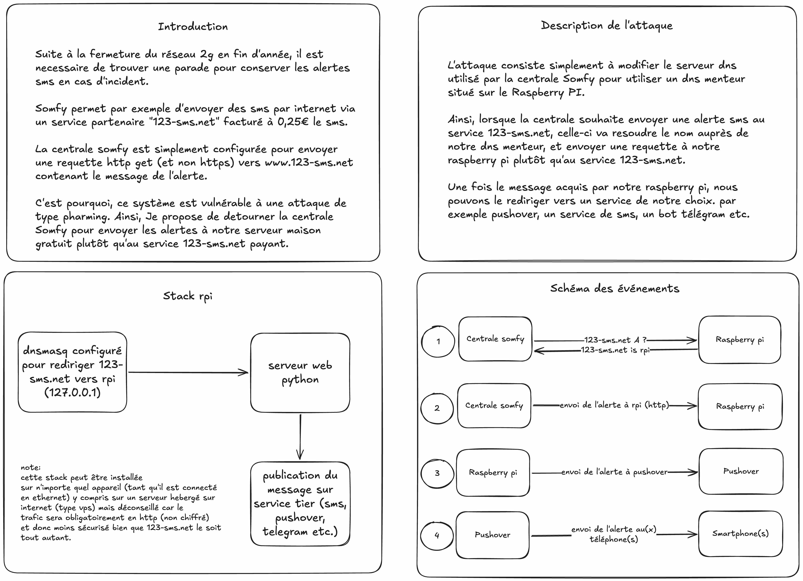

# Fonctionnement

Lorsqu'une alerte se déclenche et que la fonction « SMS par Internet » est activée, la centrale Somfy envoie une requête HTTP GET au service `123-sms.net`. Grâce à une redirection DNS (via dnsmasq), cette requête est interceptée et redirigée vers SomeNotify, qui la retransmet ensuite au backend de notification configuré (Pushover, Free Mobile SMS, etc.).

## Schéma explicatif



## Format de la requête

```
GET /http.php?email=x&pass=y&numero=z&message=hello
```

| Paramètre | Description                          | Requis |
|-----------|--------------------------------------|--------|
| `message` | Contenu de l'alerte                  | oui    |
| `numero`  | Numéro de téléphone du destinataire  | non    |
| `email`   | Email du compte                     | non    |
| `pass`    | Mot de passe du compte              | non    |
