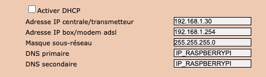
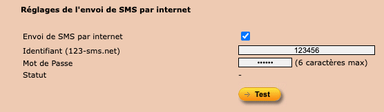

# Guide de configuration de la centrale Somfy

Ce guide explique comment configurer votre centrale Somfy Protexiom pour qu'elle envoie ses alertes à SomeNotify.

## Prérequis

- Centrale Somfy Protexiom équipée d'un **module IP**
- Le module IP doit permettre la configuration d'un **DNS personnalisé** (les dernières versions de certaines centrales ne proposent plus cette option — dans ce cas, votre centrale n'est pas compatible pour le moment)

## Principe

La centrale Somfy dispose d'une fonctionnalité d'envoi de SMS via le service **123-sms.net**. SomeNotify se fait passer pour ce serveur afin d'intercepter les alertes et les rediriger vers le backend de notification de votre choix.

Pour cela, on configure le DNS de la centrale pour que le domaine `123-sms.net` pointe vers le Raspberry Pi hébergeant SomeNotify, au lieu du serveur d'origine.

## Étape 1 — Accéder à l'interface de la centrale

1. Ouvrez un navigateur et rendez-vous sur l'adresse IP de votre centrale (ex. `http://192.168.1.30`)
2. Connectez-vous en mode **Installateur** (et non « Utilisateur »), car les réglages réseau et téléphonie ne sont accessibles que depuis ce mode

## Étape 2 — Configurer le réseau de la centrale

1. Accédez au menu **Réglages réseau** de la centrale
2. Désactivez le **DHCP** pour pouvoir modifier les champs réseau manuellement
3. Renseignez les champs suivants :

| Champ | Valeur |
|-------|--------|
| Adresse IP centrale/transmetteur | L'adresse IP de votre centrale (ex. `192.168.1.30`) |
| Adresse IP box/modem adsl | L'adresse IP de votre box Internet (ex. `192.168.1.254`) |
| Masque sous-réseau | `255.255.255.0` |
| **DNS primaire** | **L'adresse IP de votre Raspberry Pi** |
| **DNS secondaire** | **L'adresse IP de votre Raspberry Pi** |

> **Important** : les champs DNS primaire et DNS secondaire doivent contenir l'adresse IP du Raspberry Pi sur lequel SomeNotify est installé. C'est ce qui permet de rediriger les requêtes de la centrale vers SomeNotify.
>
> Si les champs DNS ne sont pas modifiables sur votre centrale, celle-ci n'est malheureusement pas compatible avec SomeNotify pour le moment.

Voici un exemple de configuration :



4. Validez les modifications

## Étape 3 — Configurer la téléphonie et les SMS par Internet

1. Accédez au menu **Réglages téléphonie filaire** de la centrale
2. Activez l'option **SMS par Internet**
3. La centrale demande des identifiants (email, mot de passe) : renseignez des valeurs quelconques, elles ne sont pas utilisées par SomeNotify
4. Dans la section **Envoi et paramétrage SMS**, renseignez au moins un numéro de téléphone
5. Validez les modifications



> **Important** : seule l'activation de la fonctionnalité SMS par Internet compte. Les identifiants renseignés n'ont aucune importance car SomeNotify ne les vérifie pas. Le numéro de téléphone n'est pas non plus utilisé par SomeNotify, mais il doit être renseigné pour que la centrale déclenche l'envoi.

## Étape 4 — Vérifier le fonctionnement

1. Assurez-vous que SomeNotify est démarré sur le Raspberry Pi :

```bash
sudo systemctl status somenotify
```

2. Ouvrez les logs de SomeNotify pour suivre les requêtes en temps réel :

```bash
sudo journalctl -u somenotify -f
```

3. Dans l'interface de la centrale, utilisez le bouton **Test** pour envoyer une alerte de test
4. Vérifiez qu'une requête apparaît dans les logs de SomeNotify

## Dépannage

- **Aucune requête reçue** : vérifiez que les DNS de la centrale pointent bien vers le Raspberry Pi et que celui-ci est accessible sur le port 80.
- **La centrale ne résout pas le DNS** : assurez-vous que le Raspberry Pi fait tourner un serveur DNS (comme dnsmasq) qui résout le domaine utilisé par la centrale vers lui-même. Voir la [documentation d'installation](installation.md) pour plus de détails.
- **Le service SomeNotify ne démarre pas** : consultez les logs avec `journalctl -u somenotify -e` pour identifier l'erreur.
